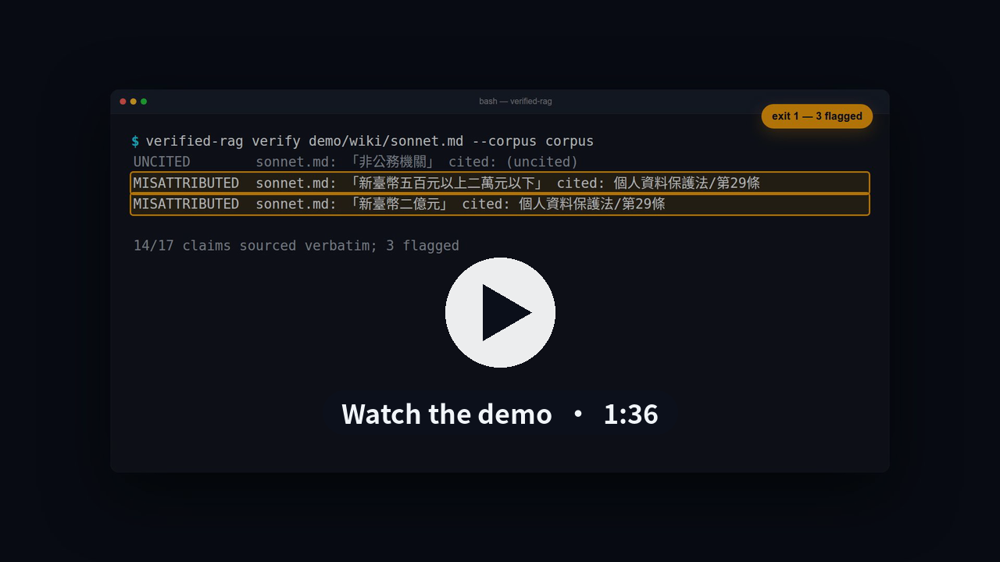

# verified-rag

**Checks for LLM-written knowledge bases: what they catch, and what they miss.**

[](https://github.com/bbudaedu/verified-rag/releases/download/demo-video/verified-rag-demo-720p.mp4)

*96-second demo; every command and output shown is from a real run. Also on the [release page](https://github.com/bbudaedu/verified-rag/releases/tag/demo-video) in 1080p.*

LLM-written knowledge bases fail in two ways that look fine at a glance. Some
claims have no source behind them (a *precision* problem). And most of the source
material never makes it into the wiki (a *recall* problem). This repo is a small
toolkit that measures both, with no runtime dependencies. It also shows that for
Chinese keyword search, joining query terms with AND instead of OR is the
difference between zero results and usable ones.

The demo corpus is public: 281 articles from four Taiwanese statutes (Personal
Data Protection Act, Cyber Security Management Act, Electronic Signatures Act,
Copyright Act). The text comes from the Ministry of Justice bulk API, as published
on 2026-09-18. Statutes are not copyrightable under Taiwan Copyright Act §9.

> **Legal status note.** That text includes the PDPA amendments promulgated on
> 2025-11-11. Their effective date is left to the Executive Yuan (PDPA §56), and
> I have not found an order setting it. The Cyber Security Management Act text
> (amended 2025-09-24) has been in force since 2025-12-01 by Executive Yuan order.
> The legal readings below describe the text as published. They are not advice
> on what is currently in force.

## Demo: two models, one prompt, one run each

The prompt ([`demo/synth_prompt.md`](demo/synth_prompt.md)) gives a model the full
text of two statutes, 101 articles in total (PDPA 66, Cyber Security Management Act
35). It asks for an 800–1,200 character wiki page for small businesses on
*penalties, breach reporting and company obligations*, and requires three things:

- cite every paragraph or list item as `[[law/article]]`
- quote statute text verbatim in 「」
- write fines as 新臺幣 amounts

I ran it once per model (`claude-sonnet-5` and `claude-haiku-4-5-20251001`),
without retries or cherry-picking. Output: [`demo/wiki/`](demo/wiki/). Tool
output: [`demo/results.md`](demo/results.md). [`demo/synth.sh`](demo/synth.sh)
regenerates the pages, but LLM output varies from run to run.

Both pages exceed the requested length: about 1,500 and 1,360 Chinese characters, not counting citation links. That
is a small example of a prompt rule not being followed.

| | Sonnet 5 | Haiku 4.5 |
|---|---|---|
| Checkable claims (quotes, amounts) | 17 | 27 |
| Flagged by `verify` | 3 | 0 |
| Articles cited / given (`coverage`) | 26 / 101 | 20 / 101 |

These numbers show what each check does. They do not rank the models. Claim
counts depend on writing style: 8 of Haiku's 27 claims are items quoted from a
single list in PDPA §19.

### What `verify` flagged, and why one of the flags is arguable

- **Uncited:** Sonnet's opening paragraph quotes the term 「非公務機關」
  (non-government entities), but that paragraph does not cite an article.
- **Arguable:** Sonnet gives the statutory damages (NT$500–20,000 per person per
  incident when actual loss is hard to prove, and a total cap of NT$200 million
  per incident unless the interest involved is higher) and cites PDPA **§29**.
  §29 is the damages article for non-government entities, which include companies,
  so the citation is legally sound. But §29 says only 「適用前條第二項至第六項規定」
  (the preceding article's paragraphs 2–6 apply). The amounts themselves are in
  **§28**, which Sonnet never cites. `verify` reports both amounts as
  `misattributed`, because they do not appear in the cited article.

Read that flag as *"a human has to follow a cross-reference to confirm this"*,
not *"this is wrong"*. String matching cannot resolve cross-references. For a
reviewer, it is still the right place to look.

### What `verify` missed

**Two statutes merged into one sentence.** Citing PDPA §48, Haiku wrote
「未依規定通報資通安全事件者，處新臺幣二萬元以上二十萬元以下罰鍰」 ("failing to report a
cyber-security incident is fined NT$20,000–200,000"). The amount is right for §48,
but §48 penalizes failing to report a **personal-data** incident. "Cyber-security
incident" is a term from the other statute. There, the penalty for not reporting
one (Cyber Security Management Act §29) is NT$300,000–10,000,000, and it applies
only to designated non-government entities (特定非公務機關). The sentence has no
quote marks, and its amount appears verbatim in §48, so `verify` passes it. A
term-level check (does the cited article mention 資通安全事件?) would catch it,
but that is not implemented.

**A quote cut short.** Haiku lists 「學術研究機構基於公共利益」 ("academic research
institutions, in the public interest") as a legal basis for collecting personal
data under §19. The statute continues: *for statistics or research, where
necessary, and only if the data cannot identify the person*. The quote is
verbatim, so it passes. What got cut is the de-identification requirement.
Verbatim matching cannot tell a quote from a quote taken out of context.

### What `coverage` shows

Neither page cites more than about a quarter of the articles it was given. That
is expected for a one-page brief on a narrow topic, and is not a failure in itself.
The useful output is the list of articles that were never cited:

- **§28 is on Sonnet's list.** That is where the damages amounts it quotes are written.
- **§6 is on both lists.** §6 covers sensitive data, including medical records,
  genetic data and criminal records. Sonnet mentions 「特種個資」 once, in passing,
  citing only §47, the penalty article. Haiku does not mention it.

## Chinese keyword search: AND vs OR

SQLite FTS5 does not segment Chinese. Its `trigram` tokenizer cannot match
two-character words, which make up much of Chinese. So a common workaround is to
split text into character bigrams and join the query's bigrams with **AND**. But
any natural question contains bigrams the statutes never use, like 「公司」
(company) or 「怎麼」 (how), so AND returns nothing. It fails silently: no error,
just zero hits.

The test set has 40 everyday-style questions, such as
「客戶的個資萬一外洩，公司有沒有義務通知客戶或報告政府？」 ("If customer data leaks, does
the company have to notify customers or the government?"). A separate model wrote
them from the corpus alone, before any search strategy was run, and was told to
avoid statute wording ([`data/queries.json`](data/queries.json)). It did not
fully succeed: 9 of the 40 still share a 4+ character term with their target
article, such as 「合理使用」 (fair use) or 「主管機關」 (competent authority).

| strategy | Hit@1 | Hit@3 | MRR |
|---|---|---|---|
| bigram-AND | 0.0% | 0.0% | 0.000 |
| bigram-OR | 27.5% | 50.0% | 0.395 |
| char-OR | 37.5% | 57.5% | 0.478 |

Hit@k counts a question as answered if **any** of its expected articles is in the
top k. Five questions expect two articles. If both are required, char-OR Hit@3
drops to 47.5%.

Two lessons:

1. **AND-to-OR is the difference between broken and usable.** On a separate
   private test set (276 Traditional Chinese notes, 26 hand-written queries with
   expected answers), the AND-to-OR change took Recall@1 from 0% to 84.6%, and
   switching to single characters raised it to 88.5%. That system indexed text
   differently from this repo, so the numbers are not directly comparable.
2. **Keyword search hits a ceiling when questions are paraphrased.** With
   questions written to avoid statute wording, char-OR reaches only 57.5% Hit@3.
   That is the argument for hybrid retrieval (BM25 plus embeddings). The number
   is reported as measured. I did not tune the query set to improve it.

## Background: why I built this

I first built these checks for a private document-intelligence system used by an
operations and audit team. It covers about 7,600 extracted documents from Drive and
Gmail (about 3,000 unique after deduplication). That code and data stay private.
These observations shaped this repo:

- **The wiki generator's own verifier is not enough.** On a first synthesis, the
  LLM rewrote a *recommended* action as an *already completed* one, and added
  configuration details that appear in no source. The generator's built-in
  verifier passed it. A prompt rule against exactly this did not prevent it.
  Verbatim claim tracing flagged it.
- **Verbatim tracing is noisy.** In one pass it flagged 89 specific dates and
  counts as unsourced. I checked 82 of them by hand, and only 2 were real errors.
  Most were the same date written a different way. That is why this repo checks
  only quotes and amounts, and why every `verify` flag comes with a reason rather
  than a bare score.
- **Precision can look perfect while recall collapses.** One 800-document slice
  had zero unsourced values, yet its wiki cited only 39 source files, about 5% of
  the slice. Across 21 slices, synthesized output stayed between 22k and 63k
  characters regardless of input size. A 13-document slice got about 1,700
  characters of wiki per document, and a 3,940-document slice got about 6.

## Usage

```bash
uv sync
curl -sS -o data/ChLaw.zip https://law.moj.gov.tw/api/ch/law/json   # ~6 MB
uv run verified-rag corpus --zip data/ChLaw.zip --out corpus \
    --law 個人資料保護法 --law 資通安全管理法 --law 電子簽章法 --law 著作權法

uv run verified-rag verify   demo/wiki/sonnet.md --corpus corpus
uv run verified-rag coverage demo/wiki/sonnet.md --corpus demo/corpus-fed --min 0.3
uv run verified-rag eval     --corpus corpus --queries data/queries.json
uv run pytest
```

Exit codes: `0` pass, `1` problems found, `2` the check could not run. Both
`verify` and `coverage` return `2` when the corpus is empty or the wiki is missing.
`verify` also returns `2` when the wiki contains no checkable claims. In a CI gate,
"verified nothing" must never look like "verified clean".

## How it works

| Module | What it does |
|---|---|
| `verify.py` | Extracts 「quoted text」 and amounts written with 新臺幣/新台幣 and Chinese numerals, including 以上…以下 ranges and one-sided 以上/以下 limits. Each citation covers its own paragraph or list item. Statuses: `ok`; `absent` (in no article); `misattributed` (in the corpus but not in the cited article); `uncited` (in the corpus, but nothing in scope cites an article); `dangling` (the cited article does not exist). Before matching, it applies NFKC, strips whitespace, and treats 台 as 臺. |
| `coverage.py` | Counts distinct cited articles out of the articles the wiki was given, and reports citations to articles not in the corpus. Below `--min`, the CLI also lists the 10 largest articles that were never cited. |
| `retrieval.py` | BM25 on SQLite FTS5 (Python stdlib). Text is split in advance into character bigrams or single characters. |

Requires Python 3.12+ and `sqlite3` with FTS5. No runtime dependencies.

## Limits

- `verify` checks only quoted text and amounts. Narrative sentences, and quotes
  taken out of context, pass. Both Haiku examples above show this.
- It does not follow cross-references like 「適用前條」.
- Quotes shorter than 4 characters are ignored: in a legal corpus they match almost anywhere.
- If a scope cites several articles, a claim passes when it matches any one of them.
- Amounts written in Arabic numerals (2萬元, NT$20,000) are skipped, not checked.
- Checking whether a claim is actually *entailed* by its source needs a second,
  independent model call. That is not included here.
- Recall here means "cited". It does not mean every fact in the source appears
  in the wiki.

## License

MIT for the code. The statute text is not subject to copyright (Copyright Act §9).

## Contact

I build LLM systems that show their sources and fail loudly: source-traced RAG,
verification gates for AI-generated documents, and Chinese/CJK retrieval. I work
async, on fixed-scope milestones. Contact me through my GitHub profile.
